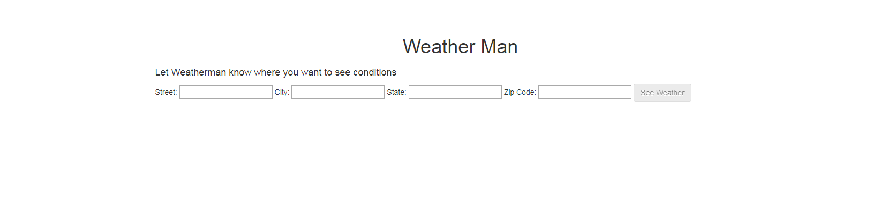
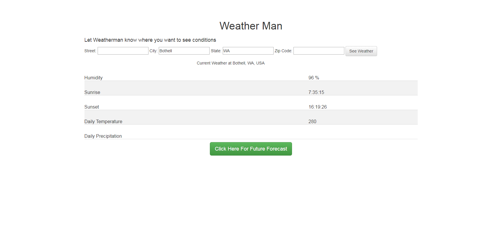

# Weather Man - This App provides weather information based on user entered address. 
# How this App  works :

User can enter any  one value State, City , Zip and can check the current weather at that location. On click of future forecast next 1 week weather information will be available for the user.

Based on the city, state, Zip entered we get the geolocation of the USER using google maps API and then call two different openweather API's for current and future forecast. 

# Stack :  
Angular 1.6 , ES5 , Karma-Jasmine , Phantom JS , Yarn , http-server for local server. 

# How to Run:
*yarn install or npm install
*npm install http-server -g
*set path to "weather-man/src/app/src/"
*http-server -a localhost -o --cors

#Next Updates 
 Test Cases, PhantomJS issue needs to be fixed
 More UI
 More Live Features 

# Notes

Initially wanted to display historical data (weather report for past 30 days and future 60 days), but couldn't find any free open weather information API available for historical data. Most of the API's are not returning the desired information, so i developed this to display one week forecast for now and will update the application to display historical data later. 
